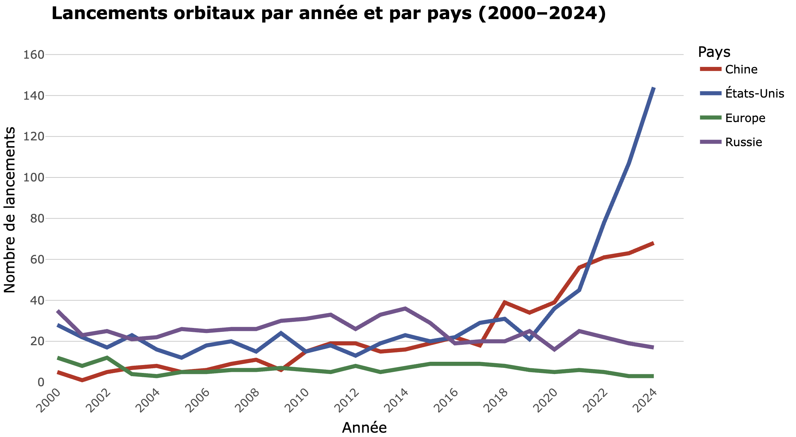
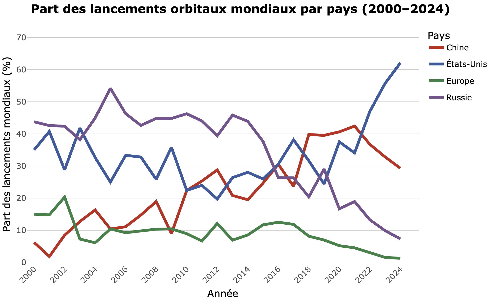

```{r setup, include=FALSE}
knitr::opts_chunk$set(echo = FALSE, message = FALSE, warning = FALSE)
library(tidyverse)
library(plotly)
```

<div class="header-bar">

  <div class="header-content header-title-centered">
<h1>POL-6078 - Projet de Session – Lancements spatiaux et ordre spatial</h1>
  </div>
</div>

<div class="content-wrapper" markdown="1">

**1. Question de recherche et hypothèse**

<div class="content-box text-justify"> <p><strong>Problématique </strong></p> <p> Le paysage spatial international s’est profondément transformé au cours des deux dernières décennies. La Chine, autrefois marginale dans les activités de lancement, se démarque progressivement et demeure désormais le principal rival des États-Unis, loin devant l’Europe et proche de la Russie. Dans ce contexte marqué par une compétition croissante et une reconfiguration de l’ordre spatial, incarnée par une multipolarité de plus en plus croissante, il devient pertinent d’examiner comment évoluent les trajectoires respectives de la Chine, des États-Unis, de la Russie et de l’Europe, notamment en s’intéressant aux lancements par année. Les lancements orbitaux témoignant généralement de la capacité d’un pays à placer en orbite des engins coûteux et technologiquement prestigieux. </div> 

<div class="content-box text-justify"> <p><strong>Question de recherche </strong></p> <p> Dans quelle mesure la progression des lancements spatiaux chinois, rapportée à celles des États-Unis, de la Russie et de l’Europe, témoigne-t-elle d’une transformation de l’ordre géopolitique spatial au XXIe siècle ? </p> </div>


<div class="content-box text-justify"> <p><strong>Revue de littérature</strong></p> <p> Depuis le lancement de son premier vol habité en 2003, par le vol habité Shenzhou-5, la Chine n’a cessé de témoigner d’une progression rapide de ses capacités de lancements, constituant l’un des principaux moteurs de la reconfiguration de l’ordre géopolitique spatial contemporain. Dotée d’un programme complet, allant des lanceurs aux infrastructures orbitales (avec le lancement de ses stations spatiales Tiangong en 2011 et de Tiangong-2 en 2021), cette progression fait désormais de la Chine un concurrent crédible des États-Unis (Morin &amp; Tepper, 2023). <p> Si les États-Unis semblent demeurer la première puissance spatiale, notamment grâce à l’intégration d’acteurs privés dans l’écosystème spatial comme SpaceX qui a réalisé 31 lancements en 2021 et 61 en 2022 (Wohrer, 2023), la montée de la Chine opère un rééquilibrage durable. Le secteur chinois maintient un rythme de lancements élevé. Parallèlement, le déclin relatif de l’Europe, qui fait face à une crise d’accès autonome à l’espace, est caractérisé par des retards industriels majeurs et à une fragmentation institutionnelle qui piègent l’Europe dans une « tenaille stratégique » (Wohrer, 2023). La Russie continue quant à elle de jouer un rôle majeur dans l’ordre spatial contemporain, malgré une influence en baisse (Aliberti et al., 2018). Héritière d’un programme spatial historique, elle demeure toujours l’un des seuls acteurs capables de vols habités. Cependant, les sanctions occidentales vinrent fragiliser son positionnement traditionnel (Vidal et al., 2023). La Russie se tourne de plus en plus vers la Chine, désormais acteur crédible sur la scène spatiale, avec des projets communs tels que la future station lunaire internationale, témoignant d’un glissement stratégique vers une coopération sino-russe accrue dans le domaine spatial (Perfilyev et al., 2010 ; Pankova et al., 2021). <p>
<p><strong>Outils utilisés</strong><p> Afin de comprendre dans quel contexte ces dynamiques s’inscrivent, Elicit servit premièrement à regrouper les ouvrages pertinents afin de constituer notre revue de littérature. Zotero fut utilisé pour regrouper nos références de manière claire et efficace. Notebook LM fut également mobilisé pour encapsuler les concepts clés de certains ouvrages.</p> </p> </div>

<div class="content-box text-justify"> <p><strong>Hypothèses principales</strong></p> <p> Depuis le lancement de son premier vol habité en 2003, par le vol haLa croissance rapide et soutenue des lancements spatiaux chinois au XXI<sup>e</sup> siècle semble constituer un indicateur de la transition d’un ordre spatial dominé par les États-Unis vers un ordre multipolaire, marqué par la montée de la Chine. <p>
Si les données montrent une augmentation importante du nombre de lancements chinois depuis les années 2000, cela confirme un processus de rattrapage. Ce rattrapage, illustré par un rapprochement des courbes sur une visualisation graphique, indiquerait une réduction de l’écart entre la Chine et les États-Unis. <p>
Si les données chinoises restent constantes, cela témoignerait d’une consolidation non seulement technologique mais également stratégique. <p> Si l’Europe stagne ou diminue dans son nombre de lancements, cela témoignerait d’un affaiblissement qui participerait à redéfinir un nouvel ordre spatial. </div>

**2. Collecte de données**

<div class="content-box text-justify"> <p><strong>Outils utilisés</strong></p> <p> Pour examiner l’évolution comparative des lancements orbitaux de la Chine, des États-Unis et de l’Europe entre 2000 et 2024, plusieurs outils numériques furent utilisés.<p>
La collecte initiale a été réalisée à partir de Gunter’s Space Page, une base de données libre et gratuite offrant des données chiffrées sur le suivi des lancements orbitaux. Afin d’assurer que les données étaient correctes, elles ont été croisées et comparées à diverses pages Wikipedia consacrées aux lancements orbitaux annuels. Microsoft Excel a ensuite été utilisé comme outil d’organisation des données où il a permis de regrouper les données par pays et années en tableau exportable en CSV. </div>

**3. Analyse et visualisation des données**

<div class="content-box text-justify"> Les trois visualisations produites permettent de mettre en évidence des tendances dans l'évolution des capacités de lancement spatial entre 2000 et 2024 et éclairent la transformation de l'ordre géopolitique spatial. </div> 

<div class="content-box"> 
 
<p class="figure-caption"><strong>Figure 1.</strong> Lancements orbitaux par année et par pays (2000–2024).</p>

<div class="content-box text-justify">
Cette visualisation nous permet premièrement d'observer une progression marquée de la Chine, qui passe d'une activité marginale au début des années 2000 à un niveau comparable à celui des États-Unis autour de 2020 et qui parvient même à les dépasser de 2018 à 2021. Les États-Unis conservent toutefois une avance importante, notamment à partir de 2022, qui peut s'expliquer principalement grâce à l'intégration de SpaceX. L'Europe est, elle, marquée par une stagnation puis une chute significative après 2020, en raison notamment des retards d'Ariane 6 et de la fin de la collaboration avec la Russie. Enfin, la Russie montre un déclin progressif et continu, accentué après 2014, qui reflète les difficultés structurelles et institutionnelles de son secteur spatial. 
</div>
</div> 

<div class="content-box text-justify">

<div style="display: flex; justify-content: center; margin: 0 auto;">

```{r carte-interactive, echo=FALSE, message=FALSE, warning=FALSE, fig.width=8, fig.height=5, out.width="80%", fig.align="center"}
european_countries <- tibble::tribble(
~region,        ~iso_alpha3,
"Allemagne",    "DEU",
"Autriche",     "AUT",
"Belgique",     "BEL",
"Danemark",     "DNK",
"Espagne",      "ESP",
"Estonie",      "EST",
"Finlande",     "FIN",
"France",       "FRA",
"Grèce",        "GRC",
"Hongrie",      "HUN",
"Irlande",      "IRL",
"Italie",       "ITA",
"Luxembourg",   "LUX",
"Norvège",      "NOR",
"Pays-Bas",     "NLD",
"Pologne",      "POL",
"Portugal",     "PRT",
"République tchèque","CZE",
"Roumanie",     "ROU",
"Royaume-Uni",  "GBR",
"Slovénie",     "SVN",
"Suède",        "SWE",
"Suisse",       "CHE"
)

df <- read_delim(
"data/lancements_pays_2000_2024.csv",
delim = ";",
col_types = cols()
)

df_long <- df %>%
pivot_longer(
cols = c(Chine, `États-Unis`, Europe, Russie),
names_to = "region",
values_to = "launches"
)

df_europe_agg <- df_long %>%
filter(region == "Europe") %>%
select(année, launches)

df_europe_expanded <- df_europe_agg %>%
cross_join(european_countries)

df_world_countries <- df_long %>%
filter(region %in% c("Chine", "États-Unis", "Russie")) %>%
mutate(iso_alpha3 = case_when(
region == "États-Unis" ~ "USA",
region == "Chine"      ~ "CHN",
region == "Russie"     ~ "RUS",
TRUE                   ~ NA_character_
))

df_choropleth_data <- df_world_countries %>%
bind_rows(df_europe_expanded) %>%
filter(!is.na(launches))

max_launches_global <- max(df_choropleth_data$launches, na.rm = TRUE)

p_choropleth_europe <- plot_geo(df_choropleth_data) %>%
add_trace(
z = ~launches,
locations = ~iso_alpha3,
color = ~launches,
colors = "Reds",
frame = ~année,
type = "choropleth",
marker = list(line = list(color = "grey", width = 0.5)),
colorbar = list(
title = "<b>Nombre de lancements par année</b>",
thickness = 12,
len = 0.6,
titlefont = list(size = 10),
tickfont = list(size = 8)
),
zmin = 0,
zmax = max_launches_global,
hoverinfo = "text",
text = ~paste0(
"Pays/Région : ", region, "<br>",
"Année : ", année, "<br>",
"Lancements : ", launches,
case_when(
region %in% european_countries$region ~ " (Valeur agrégée de l'Europe)",
TRUE ~ ""
)
)
) %>%
layout(
title = "<b>Lancements orbitaux par pays et région</b>",
geo = list(
scope = "world",
projection = list(type = "natural earth"),
showland = TRUE,
landcolor = "rgb(240, 240, 240)",
showcountries = TRUE,
countrycolor = "grey",
subunitcolor = "grey"
)
)

p_choropleth_europe
```

</div>

<p class="figure-caption"><strong>Figure 2.</strong> Lancements orbitaux par année et par pays (2000–2024).</p> <div class="content-box text-justify"> Cette carte interactive nous permet de mieux visualiser les dynamiques relatives aux lancements par années et par pays. Les pays d’Europe représentent ici les pays de l’Agence Spatiale Européenne.</div></div>


<div class="content-box">  <p class="figure-caption"><strong>Figure 3.</strong> Part des lancements orbitaux mondiaux par pays (2000–2024).</p>
<p>
<div class="content-box text-justify">Ce graphique, portant sur la part relative de chaque pays dans le total mondial des lancements annuels, permet d’aller au-delà du simple volume et d’analyser les rapports de force internationaux. On observe ainsi que la Chine accroît progressivement son poids, passant d’environ 5&nbsp;% des lancements mondiaux au début des années 2000 à plus de 20&nbsp;% vingt ans plus tard. Les États-Unis ont toujours une longueur d’avance, mais cette avance est permise grâce au secteur privé. À l’inverse, la part mondiale de l’Europe s’effondre, diminuant à environ 2&nbsp;%, tandis que celle de la Russie recule fortement. Ces résultats suggèrent que le système spatial mondial, historiquement structuré par la bipolarité entre les États-Unis et la Russie, évolue vers une nouvelle configuration, une nouvelle fois bipolaire, où la Chine s’impose comme second pôle et où l’Europe perd son autonomie stratégique.</div>

<div class="content-box text-justify"> <p><strong>Outils utilisés</strong></p> <p> Les données furent importées dans RStudio afin de pouvoir générer ces graphiques grâce au langage R. Les packages tidyverse, ggplot et plotly furent utilisés afin de pouvoir visualiser les données de manière efficace et interactive grâce à une syntaxe claire. ClaudeAI et ChatGPT ont constitué des outils supplémentaires et complémentaires afin de générer des codes et de corriger toute erreur de programmation concernant les graphiques. Finalement, GitHub me permet de stocker les fichiers qui composent ce projet de recherche. </div></div>

**4. Discussion**

<div class="content-box text-justify"> L’ensemble de ces observations nous permet d'avancer l’idée que la montée en puissance du secteur spatial chinois entraîne une reconfiguration de l’ordre spatial mondial où la scène spatiale tend désormais vers une bipolarité entre les États-Unis et la Chine, tandis que l’Europe et la Russie apparaissent en retrait. Cette dynamique confirme l’importance stratégique croissante de l’espace comme théâtre d’affirmation de puissance, à l’image des dynamiques géopolitiques terrestres. Ainsi, la progression des lancements chinois constitue un signe tangible de la transition d’un ordre spatial dominé par les États-Unis vers un système multipolaire où la Chine occupe désormais une place centrale. <p>
Les graphiques nous permettent de comprendre que la croissance et soutenue des lancements spatiaux chinois s’aligne avec l’idée d’une transition vers un environnement spatial multipolaire où la Chine se démarque de plus en plus. Cette progression réduit l’écart avec les États-Unis, qui malgré tout, restent loin devant, notamment grâce à l’intégration d’acteurs privés comme SpaceX. Parallèlement, la diminution des lancements européens mais également russes, à moindre échelle, renforce l’hypothèse d’un affaiblissement, contribuant dès lors à la redéfinition d’un nouvel ordre spatial. <p>
Cependant, il convient de rappeler que ce projet n’inclut pas des pays comme l’Inde ou le Japon, qui constituent des acteurs spatiaux émergents qu’il aurait été intéressant d’intégrer. <p>
Les différents outils mobilisés au cours de ce projet ont été sélectionnés en fonction de leur accessibilité, de leur complémentarité et de leur capacité à rendre le processus transparent et reproductible. Le recours à Gunter’s Space Page s’explique par son accessibilité gratuite et libre, ainsi que par les données claires et pertinentes qui y sont disponibles. Malgré le fait qu’il ne s’agisse pas d’une base institutionnelle, sa réputation en fait un outil fiable pour des analyses quantitatives simples. Cependant, Wikipédia, libre, gratuit et doté d’une grande communauté d’utilisateurs, permit de comparer nos données. L’utilisation d’Excel pour préparer les données se justifie par sa simplicité et son efficacité pour structurer des données en tableaux, exportables en CSV. Le choix de R et RStudio pour l’analyse découle de la nécessité de produire des visualisations reproductibles, de manière quasi infinie. RStudio est un outil open source, où la grande communauté d’utilisateurs permet une multitude de façons de visualiser ses données. Les packages tidyverse et ggplot ont été privilégiés en raison de leur intuitivité et leur popularité. L’utilisation de plotly permet de rendre la communication scientifique plus intéressante grâce à des visualisations interactives. Ainsi, l’ensemble du processus (collecte, structuration, analyse, visualisation) repose sur une logique de transparence méthodologique et de réplicabilité. L’ensemble du processus repose ainsi sur l’utilisation divers d’outils complémentaires, reflétant une approche cohérente fondée sur la transparence, la reproductibilité et l’accessibilité. </div>


**Bibliographie**

<div class="content-box bibliography"> <p>Aliberti, M., &amp; Lisitsyna, K. (2019). The Internal Evolution of the Russian Space Programme. <em>In</em> European Space Policy Institute (Eds.), <em>Russia's Posture in Space: Prospects for Europe</em> (pp. 5–54). Springer.</p>
<p>Drozhashchikh, E. (2018). China’s National Space Program and the “China Dream”. <em>Astropolitics</em>, <em>16</em>(3), 175–186. https://doi.org/10.1080/14777622.2018.1535207</p>
<p>Khan, Z., &amp; Khan, A. (2015). Chinese Capabilities as a Global Space Power. <em>Astropolitics</em>, <em>13</em>(2-3), 185–204.https://doi.org/10.1080/14777622.2015.1084168 </p>
<p>Lafaye, J., &amp; Sainjon, B. (2020). Quand les innovations remettent en cause la maîtrise de l’espace. <em>Inflexions</em>, <em>43</em>(1), 99–107. https://doi.org/10.3917/infle.043.0099</p>
<p>Morin, J.-F., &amp; Tepper, E. (2023). The empire strikes back: Comparing US and China’s structural power in outer space. <em>Global Studies Quarterly</em>, <em>3</em>(4), ksad067. https://doi.org/10.1093/isagsq/ksad067</p>
<p>Nawa, A. S., &amp; Wibowo, P. (2025). China's ambition in enhancing Indo-Pacific geopolitical power through China’s space program in 2018–2024. <em>Jurnal Ilmu Sosial dan Ilmu Politik Malikussaleh (JSPM)</em>. https://doi.org/10.29103/jspm.v6i2.21935</p>
<p>Pankova, L. V., Gusarova, O. V., &amp; Stefanovich, D. (2021). International cooperation in space activities amid great power competition. <em>Russia in Global Affairs</em>, <em>19</em>(4), 97–117. https://doi.org/10.31278/1810-6374-2021-19-4-97-117</p>
<p>Perfilyev, N. (2010). The Sino-Russian Space Entente. <em>Astropolitics</em>, <em>8</em>(1), 19–34. https://doi.org/10.1080/14777622.2010.494516</p>
<p>Pollpeter, K. L. (2020). China's Space Program: Making China Strong, Rich, and Respected. <em>Asia Policy</em>, 27, 12–18.</p>
<p>Sourbès-Verger, I. (2024). La puissance spatiale, permanences et changements. <em>L’Espace Politique</em>, 51–52. https://doi.org/10.4000/12ddu</p>
<p><p>Vidal, F., &amp; Privalov, R. (2024). Russia in outer space: A shrinking space power in the era of global change. <em>Space Policy</em>, <em>69</em>, 101579. https://doi.org/10.1016/j.spacepol.2024.101579</p>
<p>Wohrer, P. (2023). Le secteur spatial européen pris dans une tenaille stratégique. <em>Politique étrangère</em>.</p>

</div> <div style="text-align: center; margin-top: 3rem;"> <a href="https://zahramayo.github.io/" class="back-button">← Retour au site principal</a> </div> </div> <!-- fin content-wrapper --> <div class="footer-bar"> <p style="margin: 0; font-size: 0.875rem;">© 2025 Zahrat-El-Nor Maynard</p> </div>

